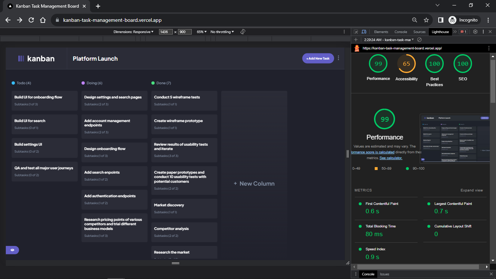
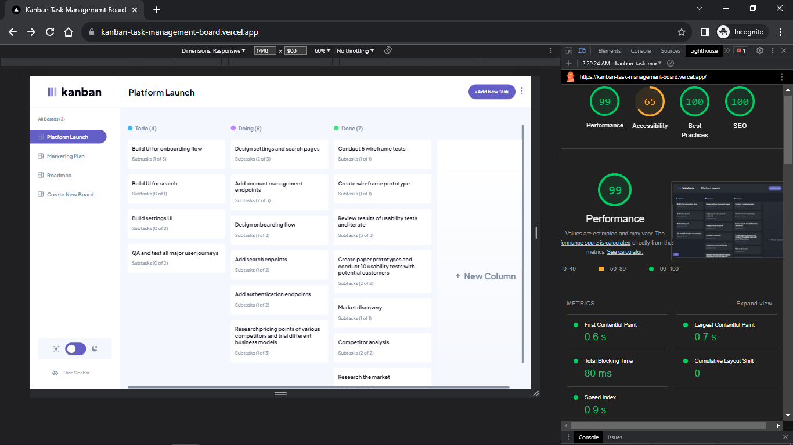
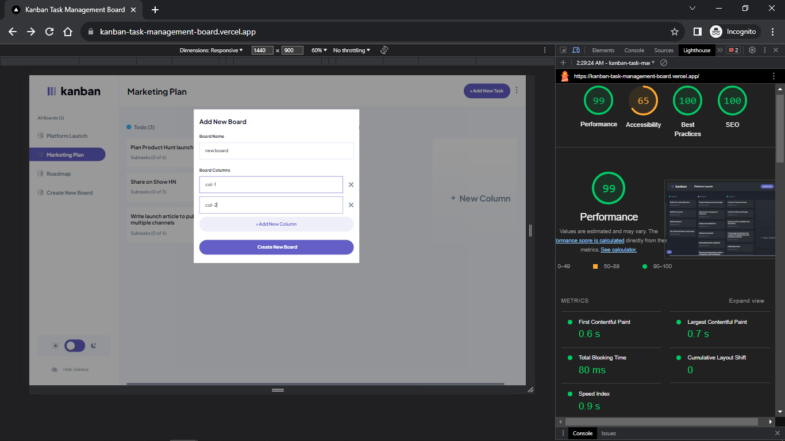
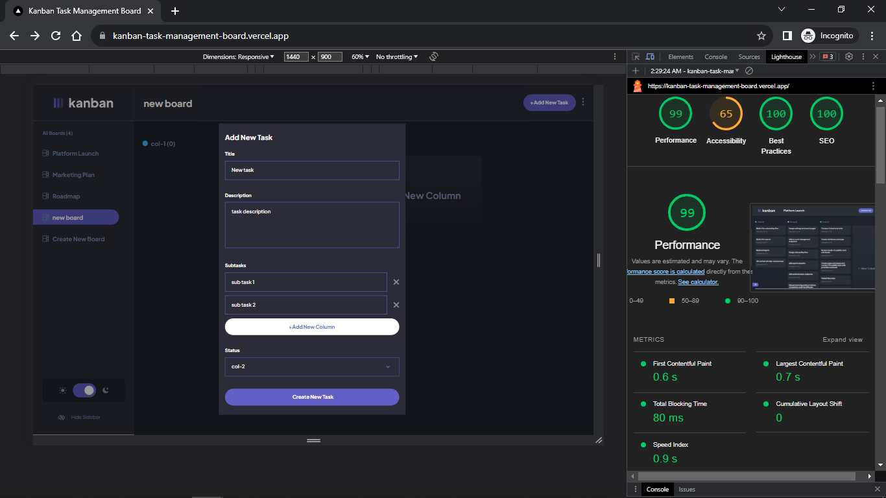
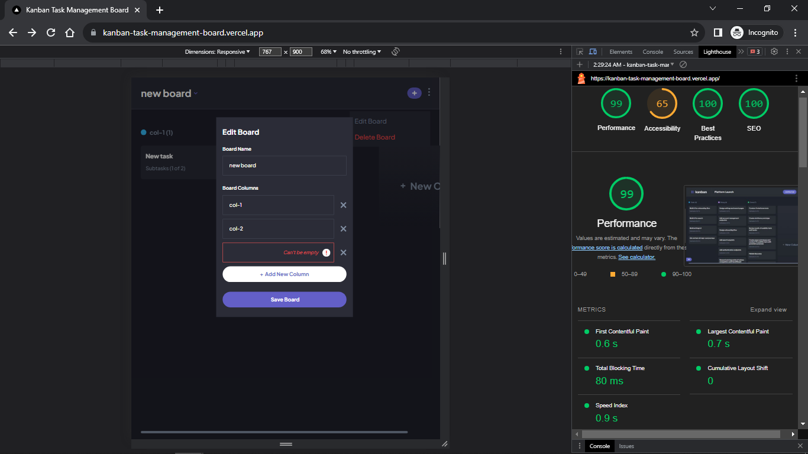
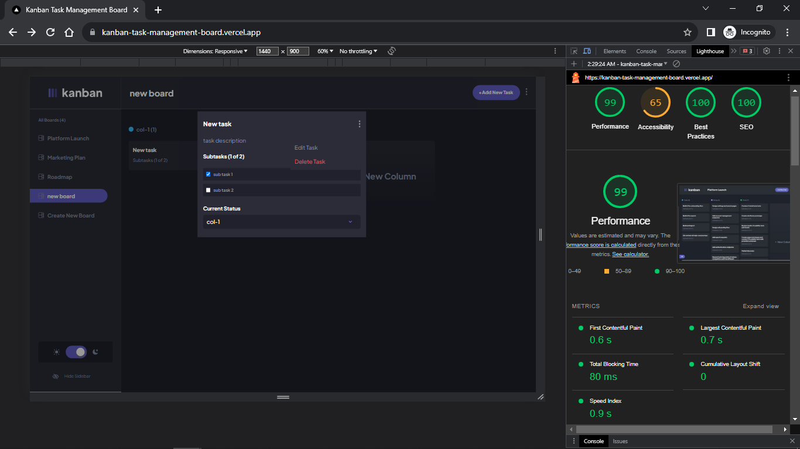

# Kanban task management web app solution

This is a solution to the [Kanban task management web app challenge on Frontend Mentor](https://www.frontendmentor.io/challenges/kanban-task-management-web-app-wgQLt-HlbB). Frontend Mentor 

## Table of contents

- [Screenshots](#screenshots)
- [The challenge](#the-challenge)
- [Links](#links)
- [Built with](#built-with)
- [Getting started](#getting-started)
- [Useful resources](#useful-resources)

## Screenshots








## The challenge

Users should be able to:

- View the optimal layout for the app depending on their device's screen size
- See hover states for all interactive elements on the page
- Create, read, update, and delete boards and tasks
- Receive form validations when trying to create/edit boards and tasks
- Mark subtasks as complete and move tasks between columns
- Hide/show the board sidebar
- Toggle the theme between light/dark modes

<!-- Working on Them -->
- **Bonus**: Allow users to drag and drop tasks to change their status and re-order them in a column 
- **Bonus**: Keep track of any changes, even after refreshing the browser (`localStorage` could be used for this if you're not building out a full-stack app)
- **Bonus**: Build this project as a full-stack application

### Links

- Live Site URL: [Kanban-task-Management](https://kanban-task-management-board.vercel.app/)

## Getting started

1. Clone the repository to your local machine from your terminal:

```
git clone https://github.com/KhaledMostafa990/kanban-task-management-board.git
```

This will create a copy of the project on your local machine.

2. Navigate to the project directory:

```
cd kanban-task-management-board
```

This will change your current working directory to the project directory.

3. Install the dependencies:

```
npm install
```

This will install all the necessary dependencies required for running the project.

4. Start the development server:

```
npm run dev
```
This will start the development server at http://localhost:3000.


## Built with

- Semantic HTML5 markup
- CSS
- Js
- Mobile-first workflow
- React - JS library
- Redux - State management
- Next.js 13 - React framework
- TawilindCss - CSS Library for styles
- Formik.js, libphonenumber-js and Yup - for contact form

## Useful resources

- [Elzero Web School](https://www.youtube.com/@ElzeroWebSchool) - for Arab developers
- [Maxmilian Academind ](https://www.youtube.com/@academind) - for Javascript
- [FrontendExpert & AlgoExpert](https://www.algoexpert.io/frontend) - for frontend developers
- [Meta Frontend Developer](https://www.coursera.org/professional-certificates/meta-front-end-developer) - for frontend developers
- [Dave Grey](https://www.youtube.com/@DaveGrayTeachesCode) - for Typescript
- [Traversy Media](https://www.youtube.com/@TraversyMedia) - for Javasciprt and CSS
- [TailwindCSS](https://tailwindcss.com/) - for TailwindCSS
- [Linkedin Learning](https://www.linkedin.com/learning/) - for every developers
